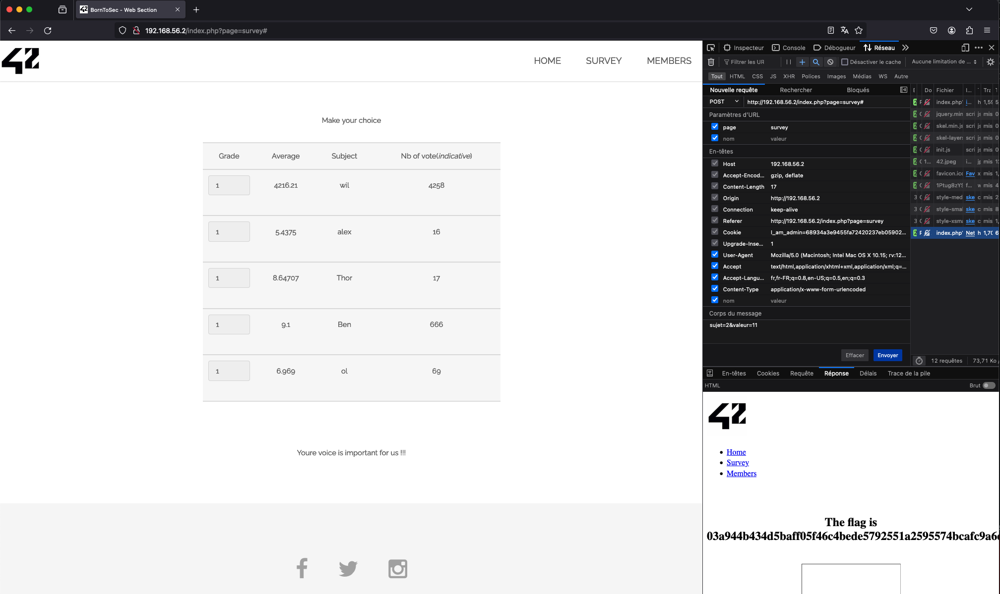

# IMPROPER DATA VALIDATION

## IDENTIFY THE VULNERABILITY

On the survey page (http://192.168.56.2/?page=survey), users can submit votes through an array with a user input. However, there are concerns about the effectiveness of input validation protection. Let's examine the security measures in place for these values.

## EXPLOIT THE VULNERABILITY

By inspecting the network traffic after submitting a vote, we identify the values (subject and value) included in the request body. Right-clicking on the POST request with Firefox allows us to edit and resend it. By modifying the value to something higher than 10, we were able to obtain the flag. Upon sending it, we checked the response to confirm successful exploitation.

> sujet=2&valeur=11

## INFORMATION ON INSECURE DATA VALIDATION

Insecure data validation poses a significant risk to a web application's overall security, rendering it vulnerable to various malicious exploits, including injection attacks such as SQL injection or Cross-Site Scripting (XSS), along with the potential for buffer overflow vulnerabilities. The inadequacy in validating input data **_can allow attackers to inject malicious code_**, compromising the application's data integrity and risking the exposure of sensitive information. Additionally, insufficient validation may lead to **_buffer overflow scenarios_** where attackers submit data exceeding the expected size, resulting in unpredictable behavior, crashes, or unauthorized code execution.

## PATCH THE VULNERABILITY

To limit this issue, it is essential to implement robust backend controls :

1. Robust Input Validation:
   Implement strict input validation mechanisms to ensure that incoming data adheres to expected formats, types, and ranges. This includes validating user inputs, API requests, and any data received from external sources.

2. Sanitization of Input:
   Utilize proper input sanitization techniques to cleanse data of any potentially malicious characters or code. This helps prevent injection attacks by neutralizing harmful elements within the input data.

3. Regular Expression Checks:
   Employ regular expressions to validate and enforce specific patterns within data. This ensures that inputs conform to predefined criteria, reducing the risk of unexpected and potentially harmful inputs.

4. Input Length and Size Limits:
   Enforce limits on the length and size of input data to prevent buffer overflows. This helps maintain the application's stability and resilience against attacks aiming to exploit memory vulnerabilities.

## SOURCES

https://cheatsheetseries.owasp.org/cheatsheets/XML_Security_Cheat_Sheet.html#improper-data-validation
