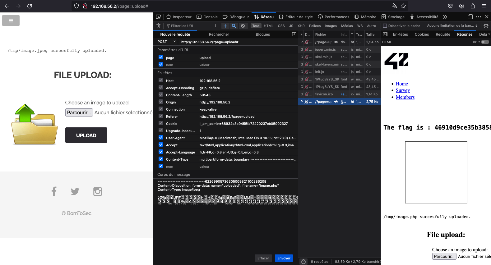

# FILE UPLOAD

## IDENTIFY THE VULNERABILITY

Users can upload images on the upload page, accessible at http://192.168.56.101/?page=upload, and these images seem to be stored in the /tmp folder. While the server permits only JPG and JPEG extensions, it seems it is lacking proper validation of the real file type, relying solely on the Content-Type header.

## EXPLOIT THE VULNERABILITY

To obtain the flag, we initially uploaded an image with a .jpg extension. Then, we exploited the vulnerability by manipulating the image extension in the request body. Using the inspect, edit, and resend functionality with Firefox, we altered it to .php, although other extensions could have been used as well. It's crucial to note that the server only validates the Content-Type, overlooking checks for the filename, file extension, or the actual content of the file.

## INFORMATION ON THE VULNERABILITY AND ITS RISKS

The vulnerability lies in the server's exclusive reliance on the Content-Type header for file validation during uploads. This allows attackers to trick the system by changing filenames and types, potentially leading to harmful actions like remote code execution and privilege escalation.

## PATCH THE VULNERABILITY

Ensure a robust filter is implemented to prevent known bypass techniques, including: - Double extensions (e.g., .php.jpg) - Null bytes (e.g., .php%00.jpg), exploiting the truncation of .jpg

Implement the following security measures:

1. Robust Filter Implementation:

   A robust filter is essential to prevent known bypass techniques, including double extensions (e.g., .php.jpg) and null bytes (e.g., .php%00.jpg) that exploit truncation vulnerabilities.

2. Content-Type Validation:

   Validate the Content-Type header against the actual file content to ensure consistency.

3. Filename Sanitization:

   Enforce proper validation and sanitization of filenames to prevent manipulation attempts.

4. File Content Validation:

   Extend checks beyond Content-Type validation and verify the integrity of the actual file content, minimizing the risk of malicious payloads.

5. File Storage Location:

   - Securely manage the storage location of uploaded files, considering access controls and encryption for added protection.
   - Additionally, it is recommended to refrain from revealing the directory where files are stored as an extra precautionary measure.

## SOURCES

https://cheatsheetseries.owasp.org/cheatsheets/File_Upload_Cheat_Sheet.html
